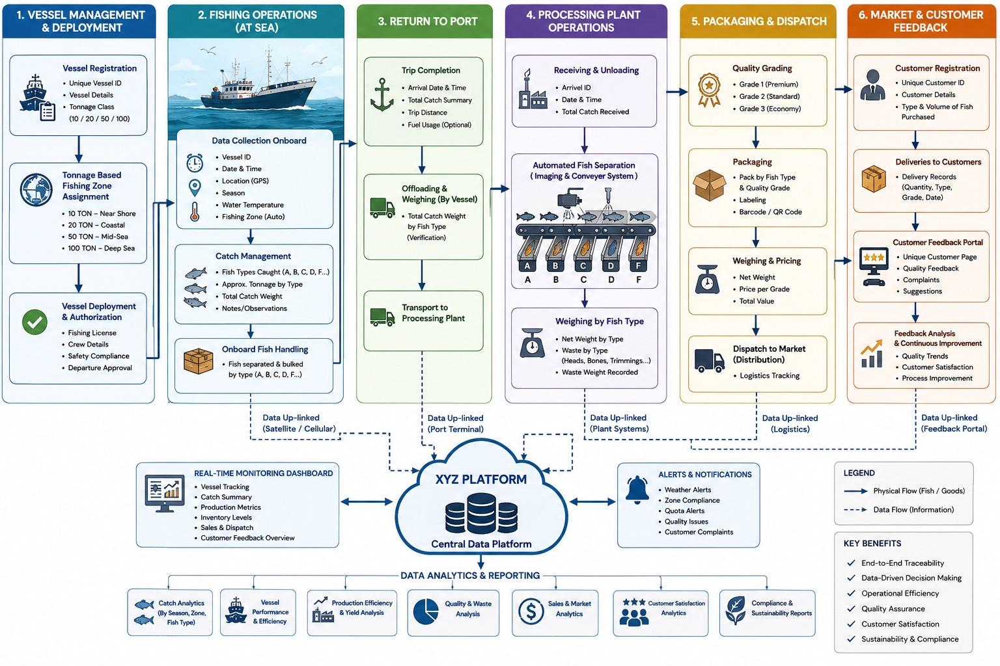

# Roadmap

Reference: the six-stage flow in
[architecture/reference-flow.jpg](architecture/reference-flow.jpg).

## Read this first: the diagram is not the Lamu fishery

The reference diagram describes an industrial fleet: 10 to 100 ton vessels,
tonnage-based zone assignment, satellite uplink at sea, conveyor imaging at
the plant. The logbook's users are artisanal fishers recording at landing,
late night to early morning, on a phone that is often offline.

The diagram sets the **order of stages and the shape of the data flow**. Its
specifics are not requirements. Every item below that comes from the diagram
and has not been checked against Lamu is marked `[TO CONFIRM]`.

## Milestones

Each milestone is a GitHub milestone. Issues carry a `stage/*` label.

### M0. Repo foundations
- Repo structure, PR automations, CI, contribution rules
- Local Supabase stack running for every team member
- GitHub usernames filled in (`.github/reviewers.json`, `docs/TEAM.md`)

### M1. Fisher logbook (diagram stage 2, plus landing weights from stage 3)
Owners: backend / tech lead (schema, sync), mobile app developer (app).

- Schema migrations in three passes `[TO CONFIRM: contents of each pass, from
  the schema spec]`. Known scope: catches ledger, append-only triggers,
  corrections table, `v_catches_effective`, `v_catch_kg`, `species_freetext`,
  `v_reconciliation_queue`
- `sync-batch` Edge Function, idempotent batch insert
- Fisher app (`apps/logbook`, React Native / Expo): catch entry, GPS,
  on-device store, outbound sync queue
- App build and distribution to fishers' phones `[TO CONFIRM: method]`
- Field test with fishers at a landing site `[TO CONFIRM: site, date, BMU]`

Diagram fields to check before they enter the schema:
`[TO CONFIRM: GPS accuracy required and behaviour with no fix]`,
`[TO CONFIRM: water temperature]`,
`[TO CONFIRM: season as stored field or derived from date]`,
`[TO CONFIRM: fishing zone, auto-assigned or self-reported]`.

### M4a. Plant receiving, minimal (slice of diagram stage 4)
Runs **in parallel with M1**. Owner: plant dashboard developer.

- Receive fish, confirm weights, issue receipts, view operational records
  (`apps/plant-dashboard`)
- Depends on M1 pass 1 schema. Until that lands, work is screens and flows
  against an agreed table contract, not a live database
- `[TO CONFIRM: what a receipt must contain, and who it is issued to]`

### M2. Vessel and fisher registry (diagram stage 1)
- Vessel / fisher registration with unique IDs
- Licence, crew and safety records `[TO CONFIRM: which records BMUs and the
  County Department of Fisheries already hold]`
- Diagram's tonnage classes and tonnage-based zone assignment
  `[TO CONFIRM: likely not applicable to artisanal vessels]`

### M3. Return to port (diagram stage 3)
- Trip completion summary
- Offloading and verified weighing by species
- Transport-to-plant handover record

### M4. Processing plant, full (diagram stage 4)
Builds on M4a. Overlaps the Mokowe facility optimization tool. Shares the species list.
- Weighing by type, net and waste weight
- Equipment integration, local site server and AWS (`infra/`), owner: cloud /
  integration / testing developer
- Diagram's automated imaging and conveyor separation
  `[TO CONFIRM: no such equipment is confirmed at Mokowe]`

### M5. Packaging and dispatch (diagram stage 5)
- Quality grading, packaging and labelling, barcode / QR
- Weighing and pricing, dispatch and logistics tracking

### M6. Market and customer feedback (diagram stage 6)
- Customer registration, delivery records
- Feedback portal, feedback analysis

### Platform layer (cuts across all stages)
Built incrementally as each stage produces data, not as a separate phase.
- Central data platform: this repo's Supabase schema
- Monitoring dashboard
- Alerts and notifications
- Analytics and reporting: catch, vessel performance, yield, quality and
  waste, sales, customer satisfaction, compliance and sustainability

## Sequencing rule

M1 and M4a run in parallel and both wait on the M1 pass 1 schema, so that is
the critical path. Every other stage starts only when the stage before it has
real data flowing. M2, M3, M4 (full), M5 and M6 are not scheduled.
`[TO CONFIRM: target dates for M0, M1 and M4a]`
